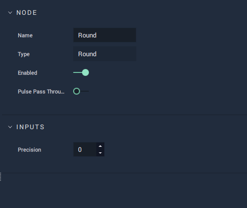

# Overview

The **Round** **Node** takes a numerical value and _rounds_ it with a chosen precision.

The following table shows a few examples:

|`Input`| `Precision`| `Output`|
|---|---|---|
| 5.45 | 1 | 5.5 |
| 5.44 | 1 | 5.4 |
| 12.11232 | 3| 12.112 |
| 12.11232 | 2 | 12.11 |
| 12.11232 | 1 | 12.1 |
| 12.11232 | 0 | 12 |

[**Scope**](../overview.md#scopes): **Project**, **Scene**, **Function**, **Prefab**.

# Attributes

|Attribute|Type|Description|
|---|---|---|
| `Precision` | **Int** | Indicates the maximum number of decimal places that the `Output` can have.|

# Inputs

|Input|Type|Description|
|---|---|---|
|*Pulse Input* (►)|**Pulse**|A standard **Input Pulse**, to trigger the execution of the **Node**.|
| `Input` | **Float** | The value to be _rounded_. |

# Outputs

|Output|Type|Description|
|---|---|---|
|*Pulse Output* (►)|**Pulse**|A standard **Output Pulse**, to move onto the next **Node** along the **Logic Branch**, once this **Node** has finished its execution.|
| `Output` | **Float** | The _rounded_ value. |

# See Also

* [**Floor**](floor.md)
* [**Ceil**](ceil.md)

# External Links

* [_Rounding_](https://en.wikipedia.org/wiki/Rounding) on Wikipedia.
