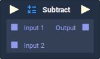

# Subtract

## Overview

**Subtract** is a _basic arithmetic operation_ **Node**, which performs a sequence of subtraction operations, from top-to-bottom, for each `Input` **Socket**, whose value is subtracted from the result of the previous operation.

This is the equivalent of the subtraction \(`-`\) operation in computer science and mathematics.

## Attributes

| Attribute | Type | Description |
| :--- | :--- | :--- |
| `Data Type` | **Drop-down** | The type of data that will be plugged into the `Input` **Sockets**. |
| `Default Inputs` | _Defined in the `Data Type` **Attribute**_. | The amount of `Input` **Sockets** and their default values if they have no data connected to them. |

## Inputs

| Input | Type | Description |
| :--- | :--- | :--- |
| _Pulse Input_ \(►\) | **Pulse** | A standard input **Pulse**, to trigger the execution of the **Node**. |
| `Input [n]` | _Defined in the `Data Type` **Attribute**._ | The values to be subtracted sequentially, from top-to-bottom. |

## Outputs

| Output | Type | Description |
| :--- | :--- | :--- |
| _Pulse Output_ \(►\) | **Pulse** | A standard output **Pulse**, to move onto the next **Node** along the **Logic Branch**, once this **Node** has finished its execution. |
| `Output` | _Defined in the `Data Type` **Attribute**._ | The result of the subtraction operation\(s\). |

