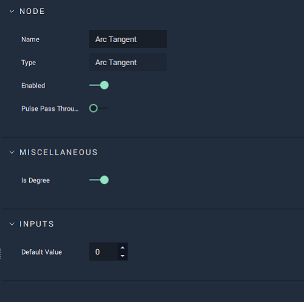

# Arc Tangent

## Overview

The **Arc Tangent Node** takes a single **Float** value and returns its _arctangent_, in degrees \(°\) or radians \(rad\).

[**Scope**](../../overview.md#scopes): **Project**, **Scene**, **Function**, **Prefab**.

## Attributes

### Miscellaneous

| Attribute | Type | Description |
| :--- | :--- | :--- |
| `Is Degree` | **Bool** | Determines whether the `Output` value is given in degrees \(°\) or radians \(rad\). |

### Inputs

| Attribute | Type | Description |
| :--- | :--- | :--- |
| `Default Value` | **Float** | The default value of `Input`, if no value is provided in the `Input` **Socket**. |

## Inputs

| Input | Type | Description |
| :--- | :--- | :--- |
| _Pulse Input_ \(►\) | **Pulse** | A standard **Input Pulse**, to trigger the execution of the **Node**. |
| `Input` | **Float** | The value to calculate the _arctangent_ of. |

## Outputs

| Output | Type | Description |
| :--- | :--- | :--- |
| _Pulse Output_ \(►\) | **Pulse** | A standard **Output Pulse**, to move onto the next **Node** along the **Logic Branch**, once this **Node** has finished its execution. |
| `Output` | **Float** | The $arctangent$ of `Input`. |

## See Also

* [**Trigonometry**](./)
* [**Tangent**](tangent.md)
* [**Radian-Degree Converter**](radian-degree-converter.md)

## External Links

* [_Trigonometry_](https://www.khanacademy.org/math/trigonometry) on Khan Academy.
* [_Sine, Cosine and Tangent_](https://www.mathsisfun.com/sine-Cosine-tangent.html) on Maths is Fun.

