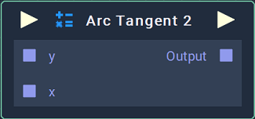
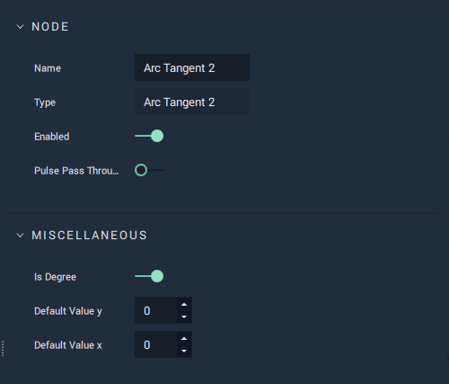

# Arc Tangent 2

## Overview

The **Arc Tangent 2** **Node** takes two **Float** values, $$y$$ and $$x$$, and returns $$atan2(y,x)$$. The result can be obtained in degrees (°) or radians (rad).

The function $$atan2(y,x)$$ is of common use in computer science and can be equivalently defined as:

* The angle $$\theta$$ in the _Euclidean plane_ between the positive $$X$$ axis and the ray connecting the origin and the point $$(x,y)$$.
* The phase $$\theta$$ of the complex number $$x+iy$$. That is, the angle $$\theta \in (-\pi, \pi]$$ such that $$x=r\cos\theta$$ and $$y=r\sin\theta$$, where $$r=\sqrt{x^2+y^2}$$.

[**Scope**](../../overview.md#scopes): **Project**, **Scene**, **Function**, **Prefab**.

## Attributes

#### Miscellaneous

| Attribute         | Type      | Description                                                                          |
| ----------------- | --------- | ------------------------------------------------------------------------------------ |
| `Is Degree`       | **Bool**  | Determines whether the `Output` value is given in degrees (°) or radians (rad).      |
| `Default Value y` | **Float** | The default value of `Input Y`, if no value is provided in the **Input** **Socket**. |
| `Default Value x` | **Float** | The default value of `Input X`, if no value is provided in the **Input Socket**.     |

## Inputs

| Input             | Type      | Description                                                           |
| ----------------- | --------- | --------------------------------------------------------------------- |
| _Pulse Input_ (►) | **Pulse** | A standard **Input Pulse**, to trigger the execution of the **Node**. |
| `y`               | **Float** | The $$y$$ input value.                                                  |
| `x`               | **Float** | The $$x$$ input value.                                                  |

## Outputs

| Output             | Type      | Description                                                                                                                            |
| ------------------ | --------- | -------------------------------------------------------------------------------------------------------------------------------------- |
| _Pulse Output_ (►) | **Pulse** | A standard **Output Pulse**, to move onto the next **Node** along the **Logic Branch**, once this **Node** has finished its execution. |
| `Output`           | **Float** | The value of $$atan2(y,x)$$, either in degrees (°) or radians (rad) according to the `Is Degree` **Attribute**.                          |

## See Also

* [**Trigonometry**](./)
* [**Radian-Degree Converter**](radian-degree-converter.md)

## External Links

* [_atan2_](https://en.wikipedia.org/wiki/Atan2) on Wikipedia.
