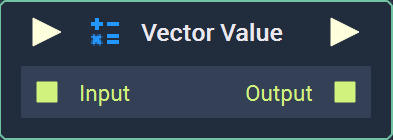
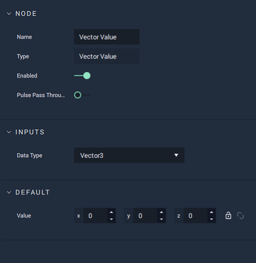

# Vector Value

## Overview

The **Vector Value** **Node** generates a **Vector**. It can either be a **Vector2**, **Vector3**, or **Vector4**.

[**Scope**](../overview.md#scopes):
*  **Project**, **Scene**, **Function**, **Prefab**

## Attributes

### Inputs

| Attribute | Type | Description |
| :--- | :--- | :--- |
| `Data Type` | **Drop-down** | Whether a **Vector2**, **Vector3**, or **Vector4** will be generated. |

### Default

| Attribute | Type | Description |
| :--- | :--- | :--- |
| `Value` | _Defined in the `Data Type` **Attribute**_ | The `Value` that the generated **Vector** will have. |

## Inputs

| Input | Type | Description |
| :--- | :--- | :--- |
| _Pulse Input_ \(►\) | **Pulse** | A standard **Input Pulse**, to trigger the execution of the **Node**. |
| `Input` | _Defined in the `Data Type` **Attribute**_ | A **Vector** you wish to add to the **Vector Value** **Node**. |

## Outputs

| Output | Type | Description |
| :--- | :--- | :--- |
| _Pulse Output_ \(►\) | **Pulse** | A standard **Output Pulse**, to move onto the next **Node** along the **Logic Branch**, once this **Node** has finished its execution. |
| `Output` | _Defined in the `Data Type` **Attribute**_ | The generated **Vector**. |

## External Links

* [_Euclidean vector_](https://en.wikipedia.org/wiki/Euclidean_vector) on Wikipedia.

