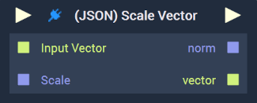

# Overview

The **(JSON) Scale Vector Node** scales a **Vector3** by the **Float** value given as **Input**. It returns the scaled **Vector3** as well as the Euclidean norm of the new **Vector3**. 

For example, if a vector of `[2,3,6]` were inputted and the given scaling value were `4`, the resulting `vector` would be `[8,12,24]` and the `norm` would be `28`. 

Please note that this **Node** appears only when the **Logic Plugin** example is followed, the instructions of which can be found [here](../plugins/README.md#example). It will also disappear when the **Plugin** is deactivated in the **Plugin Module**.

[**Scope**](../overview.md#scopes): **Project**, **Scene**, **Function**.

# Inputs

|Input|Type|Description|
|---|---|---|
|*Pulse Input* (►)|**Pulse**|A standard **Input Pulse**, to trigger the execution of the **Node**.|
|`Input Vector`|**Vector3**|The **Vector3** to be scaled.|
|`Scale`|**Float**|The value by which the **Vector3** will be scaled.|

# Outputs

|Output|Type|Description|
|---|---|---|
|*Pulse Output* (►)|**Pulse**|A standard **Output Pulse**, to move onto the next **Node** along the **Logic Branch**, once this **Node** has finished its execution.|
|`norm`|**Float**|The calculated Euclidean norm of the resulting scaled **Vector3**.|
|`vector`|**Vector3**|The resulting scaled **Vector3**.|

# External Links

* More on the [*Euclidean norm*.](https://en.wikipedia.org/wiki/Norm_(mathematics)#Euclidean_norm)

