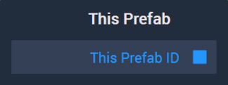

# Overview

The **This Prefab Node** provides the ID of the current **Prefab** being worked on. It is only avaialble in the **Prefab** secton of the **Logic Editor** when a **Prefab** has been selected. 

[**Scope**](../overview.md#scopes): **Prefab**.

## Outputs

| Output | Type | Description |
| :--- | :--- | :--- |
| `This Prefab ID` | **ObjectID** | The ID of the current **Prefab**. |

## See Also

* [**Logic in Prefabs**](../../objects-and-types/prefabs/logic-prefabs.md)