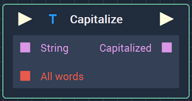
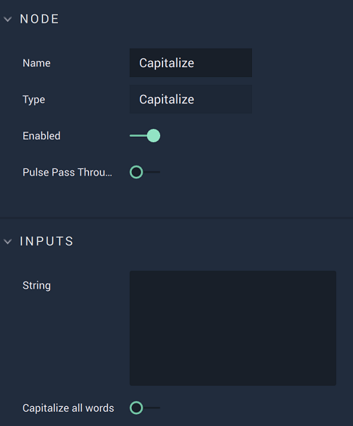

# Overview

The **Capitalize Node** capitalizes a **String**, converting the first character to uppercase. If the **Bool** `All words` is set to *True*, the **Node** capitalizes every word in the **String**. 

# Attributes

|Attribute|Type|Description|
|---|---|---|
|`String`|**String**|The **String** to be capitalized.|
|`Capitalize all words`|**Bool**|Toggled on or off depending on if the user wishes to capitalize every word in the **String** or not.|

# Inputs

|Input|Type|Description|
|---|---|---|
|*Pulse Input* (►)|**Pulse**|A standard **Input Pulse**, to trigger the execution of the **Node**.|
|`String`|**String**|The **String** to be capitalized.|
|`All words`|**Bool**|Toggled on or off depending on if the user wishes to capitalize every word in the **String** or not.|

# Outputs

|Output|Type|Description|
|---|---|---|
|*Pulse Output* (►)|**Pulse**|A standard **Output Pulse**, to move onto the next **Node** along the **Logic Branch**, once this **Node** has finished its execution.|
|`Capitalized`|**String**|The **String**, now capitalized at the preference of the user.|

