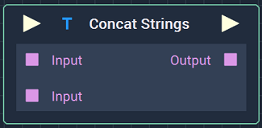
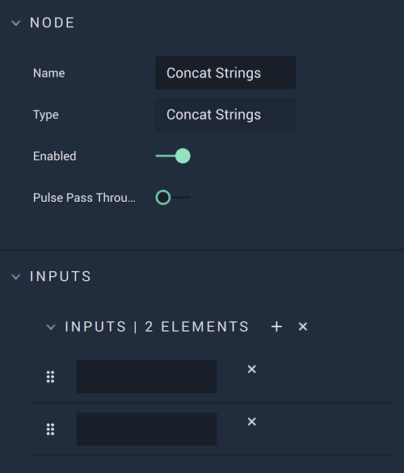

# Concat Strings

## Overview

**Concat Strings** joins two or more **Strings** into one new **String**.

## Attributes

| Attribute | Type | Description |
| :--- | :--- | :--- |
| `Inputs` | **User Input** | The **Strings** to be concatenated. The user can add more elements with the `+` or delete an element with the `x`. |

## Inputs

| Input | Type | Description |
| :--- | :--- | :--- |
| _Pulse Input_ \(►\) | **Pulse** | A standard **Input Pulse**, to trigger the execution of the **Node**. |
| `Input [n]` | **String** | The **Strings** to be concatenated. The number of `Inputs` matches the number of elements in the **Attributes**. |

## Outputs

| Output | Type | Description |
| :--- | :--- | :--- |
| _Pulse Output_ \(►\) | **Pulse** | A standard **Output Pulse**, to move onto the next **Node** along the **Logic Branch**, once this **Node** has finished its execution. |
| `Output` | **String** | The concatenated **String**. |

## External Links

* Information about [_Concatenation_](https://en.wikipedia.org/wiki/Concatenation) on Wikipedia.

