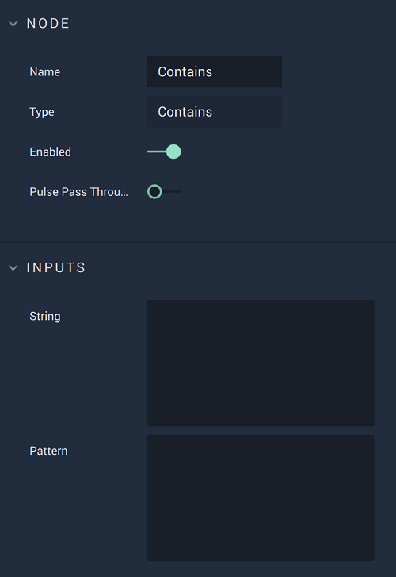

# Overview

The **Contains** **Node** receives two **Strings** and checks whether one is a *substring* of the other. It outputs the result as a **Boolean**.

# Attributes

## Inputs

|Attribute|Type|Description|
|---|---|---|
| `String` | **String** | **String** to be checked for having `Pattern` as a *substring*, if none is given in the **Input Socket**.|
| `Pattern` | **String** | **String** to be checked for being a *substring* of `String`, if none is given in the **Input Socket**. |

# Inputs

|Input|Type|Description|
|---|---|---|
|*Pulse Input* (►)|**Pulse**|A standard **Input Pulse**, to trigger the execution of the **Node**.|
| `String` | **String** | **String** to be checked for having `Pattern` as a *substring*.|
| `Pattern` | **String** | **String** to be checked for being a *substring* of `String`. |

# Outputs

|Output|Type|Description|
|---|---|---|
|*Pulse Output* (►)|**Pulse**|A standard **Output Pulse**, to move onto the next **Node** along the **Logic Branch**, once this **Node** has finished its execution.|
| `Contains` | **Bool** | *True*, if `Pattern` is a *substring* of `String`; *false*, otherwise. |

# External Links

* [*Substring*](https://en.wikipedia.org/wiki/Substring) on Wikipedia.

