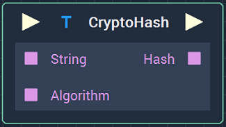
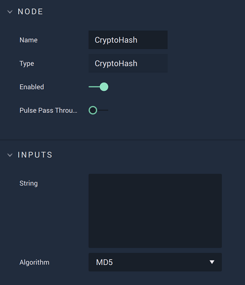

# Overview

The **CryptoHash** **Node** takes a **String** and encrypts it as a _hash_ using an algorithm chosen by the user.

[**Scope**](../overview.md#scopes): **Project**, **Scene**, **Function**, **Prefab**.

# Attributes

|Attribute|Type|Description|
|---|---|---|
| `String` | **String** | The **String** that will be encrypted, if none is given in the **Input Socket**. |
| `Algorithm` | **Drop-down** | The algorithm that will be used for the encryption, if none is given in the **Input Socket**. The available options are `MD5`, `SHA-1`, and `SHA-256`. |

# Inputs

|Input|Type|Description|
|---|---|---|
|*Pulse Input* (►)|**Pulse**|A standard **Input Pulse**, to trigger the execution of the **Node**.|
| `String` | **String** | The **String** that will be encrypted. |
| `Algorithm` | **String** | The algorithm that will be used for the encryption. It should be one of the available options: `MD5`, `SHA-1`, or `SHA-256`. |

# Outputs

|Output|Type|Description|
|---|---|---|
|*Pulse Output* (►)|**Pulse**|A standard **Output Pulse**, to move onto the next **Node** along the **Logic Branch**, once this **Node** has finished its execution.|
| `Hash` | **String** | The _hash value_ corresponding to the **String** given as input. |

# External Links

* [_Cryptographic hash function_](https://en.wikipedia.org/wiki/Cryptographic_hash_function) on Wikipedia.
* [_MD5_](https://en.wikipedia.org/wiki/MD5) on Wikipedia.
* [_SHA-1_](https://en.wikipedia.org/wiki/SHA-1) on Wikipedia.
* [_SHA-2_](https://en.wikipedia.org/wiki/SHA-2) on Wikipedia.