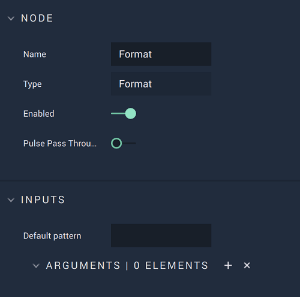

# Overview

The **Format** **Node** receives a **Pattern** **String** that can contain *format specifiers* and data as a chosen number of parameters. It then outputs the **String** formatted with the parameters in place of the *format specifiers*. The *format specifiers* define the type of data that will fill them and the format the data will be shown in.

This **Node** is useful for when data needs to be presented within a text. For example, it can be utilized to show the current temperature. For this, we can use the **Pattern** **String** `The current temperature is %.1f °C`, where `%.1f` is the _format specifier_ that indicates that a **Float** value with one decimal place will take that position in the final formatted **String**. The value of the current temperature has to be given to the **Node** as a **Float** value in the corresponding parameter **Input Socket** and then, if the current temperature is, say, `20.3` degrees Celsius, the formatted **String** that the **Node** outputs will be `The current temperature is 20.3°C`.

A more detailed description of [format specifiers](#format-specifiers) and [usage examples of the **Node**](#usage-examples) can be found below.

# Attributes

## Inputs

|Attribute|Type|Description|
|---|---|---|
| `Default Pattern` | **String** | The **Pattern String**, if none is given in the `Pattern` **Input Socket**. |

## Arguments

|Attribute|Type|Description|
|---|---|---|
| `Parameter [n]` | **Drop-down** | The parameter value, if none is given in the corresponding **Input Socket**.  |

# Inputs

|Input|Type|Description|
|---|---|---|
|*Pulse Input* (►)|**Pulse**|A standard **Input Pulse**, to trigger the execution of the **Node**.|
| `Pattern` | **String** | The **Pattern String**. |
| `Parameter [n]` | **Drop-down** | The parameter value. |

# Outputs

|Output|Type|Description|
|---|---|---|
|*Pulse Output* (►)|**Pulse**|A standard **Output Pulse**, to move onto the next **Node** along the **Logic Branch**, once this **Node** has finished its execution.|
| `Formatted` | **String** | The formatted **String**, with the parameters replacing the *format specifiers*. |

# Format Specifiers

*Format specifiers* are part of the input **Pattern String** and they indicate the place and format in which the data will be displayed.

They are written in the form `%[width][.precision]type`, where *width* and *precision* are optional and *type* is mandatory:

* *Width* indicates the minimum number of characters to output, filling with blank spaces at the beginning when the data uses fewer characters. This is useful, for example, for when the number of digits in the input data can vary and we need to keep the data field aligned.
* *Precision* indicates a maximum number of characters to output, depending on the type that is used. For **Floats**, it indicates the maximum number of digits right of the decimal point to use; for **Strings**, it limits the number of characters to output, truncating the input **String** if it exceeds this number.
* *Type* indicates the **Data Type** with which the *format specifier* will be filled. The possible *types* are shown in the following table:  

    | *Format specifier* | **Type**|
    |---|---|
    | %c | Character |
    | %d | Signed decimal integer |
    | %e | Scientific notation |
    | %f | Float |
    | %i | Integer |
    | %o | Unsigned octal |
    | %s | String |
    | %u | Unsigned decimal integer |
    | %x | Unsigned hexadecimal integer |

# Usage Examples

The following table shows several examples on how to use the **Format Node**, specifying the inputs (`Pattern`, `Parameter1`, `Parameter2`) and the output (`Formatted`).

| `Pattern` | `Parameter1`| `Parameter2` | `Formatted` |
|---|---| --- | ---|
| The first letter of %s is %c | trees | trees | The first letter of trees is t |
| The numbers %d and %d are twin primes | 101 | 103 | The numbers 101 and 103 are twin primes |
| The number %.0f can be written as %.1e | 25000000000 | 25000000000 | The number 25000000000 can be written as 2.5e+10 |
| The current speed is %3f km/h | 99 | - | The current speed is  99 km/h |
| The current temperature is %4.2f °C | 25.4739 | - | The current temperature is 25.47 °C |
| The number %i is a prime factor of %i | 3037 | 6074 | The number 3037 is a prime factor of 6074 |
| Decimal number %u written as an octal is %o | 9 | 9 | Decimal number 9 written as an octal is 11 |
| Decimal number %u written as an hexadecimal is %x | 12 | 12 | Decimal number 12 written as an hexadecimal is c |

# See Also

* [**FormatArray**](formatarray.md)

# External Links

* [_Printf Format String_](https://en.wikipedia.org/wiki/Printf_format_string) on Wikipedia.
* [_Printf_](https://www.cplusplus.com/reference/cstdio/printf/) on cplusplus.com.