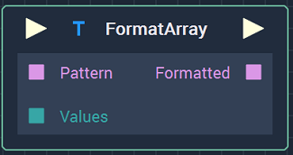
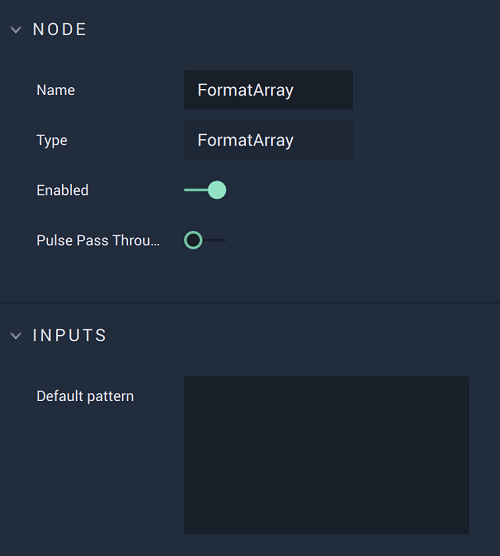

# Overview

The **FormatArray** **Node** receives a **Pattern** **String** that can contain *format specifiers* and an **Array** containing data values. It then outputs the **String** formatted with the data values from the **Array** in place of the *format specifiers*. The *format specifiers* define the type of data that will fill them and the format the data will be shown in.

This **Node** is useful for when data needs to presented within a text. For example, to show the current temperature. For this, we can use the **Pattern** **String** `The current temperature is %.1f °C`, where `%.1f` is the _format specifier_ that indicates that a **Float** value with one decimal place will take that position in the final formatted **String**. The value of the current temperature has to be given to the **Node** as a value in an **Array** and then, if the current temperature is, say, `20.3` degrees Celsius, the formatted **String** that the **Node** outputs will be `The current temperature is 20.3°C`.

See more about [*format specifiers*](format.md#format-specifiers) and [*usage examples*](format.md#usage-examples).

*Scope*: **Project**, **Scene**, **Function**, **Prefab**

# Attributes

## Inputs

|Attribute|Type|Description|
|---|---|---|
| `Default Pattern` | **String** | The **Pattern String**, if none is given in the `Pattern` **Input Socket**. |

# Inputs

|Input|Type|Description|
|---|---|---|
|*Pulse Input* (►)|**Pulse**|A standard **Input Pulse**, to trigger the execution of the **Node**.|
| `Pattern` | **String** | The **Pattern String**. |
| `Values` | **Array** | **Array** containing the data values that will be used to replace the *format specifiers*. |

# Outputs

|Output|Type|Description|
|---|---|---|
|*Pulse Output* (►)|**Pulse**|A standard **Output Pulse**, to move onto the next **Node** along the **Logic Branch**, once this **Node** has finished its execution.|
| `Formatted` | **String** | The formatted **String**, with the data values from the **Array** replacing the *format specifiers*. |

# See Also

* [**Format Array**](formatarray.md)

# External Links

* [_Printf Format String_](https://en.wikipedia.org/wiki/Printf_format_string) on Wikipedia.
* [_Printf](https://www.cplusplus.com/reference/cstdio/printf/) on cplusplus.com.

