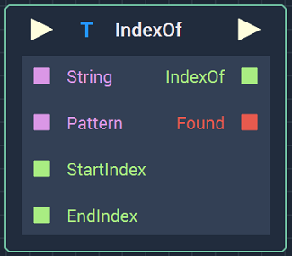
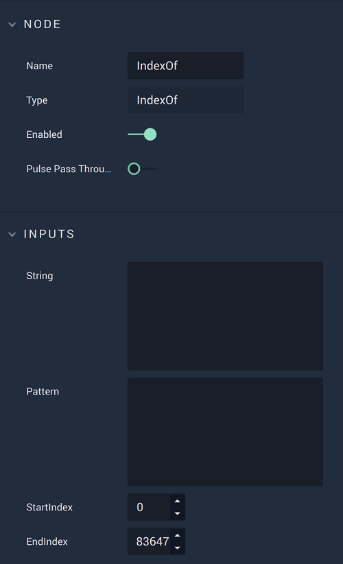

# Overview

The **IndexOf** **Node** returns the index of the first occurrence of a *substring* in a **String** and a **Bool** indicating whether it was found or not.

The range in which the *substring* will be searched can be customized via the `StartIndex` and `EndIndex` **Attributes**.

# Attributes

|Attribute|Type|Description|
|---|---|---|
| `String` | **String** | The **String** in which the search will be performed, if none is given in the **Input Socket**. |
| `Pattern` | **String** | The *substring* that will be searched for, if none is given in the **Input Socket**. |
| `StartIndex` | **Int** | The *index* of `String` in which the search will start, if none is given in the **Input Socket**. |
| `EndIndex` | **Int** | The *index* of `String` in which the search will end, if none is given in the **Input Socket**. |

# Inputs

|Input|Type|Description|
|---|---|---|
|*Pulse Input* (►)|**Pulse**|A standard **Input Pulse**, to trigger the execution of the **Node**.|
| `String` | **String** | The **String** in which the search will be performed. |
| `Pattern` | **String** | The *substring* that will be searched for. |
| `StartIndex` | **Int** | The *index* of `String` in which the search will start. |
| `EndIndex` | **Int** | The *index* of `String` in which the search will end. |

# Outputs

|Output|Type|Description|
|---|---|---|
|*Pulse Output* (►)|**Pulse**|A standard **Output Pulse**, to move onto the next **Node** along the **Logic Branch**, once this **Node** has finished its execution.|
| `IndexOf` | **Int** |The *index* of the first occurrence of `Pattern` in `String`.  |
| `Found` | **Bool** | Whether `Pattern` was found in `String` or not. |

# See Also

* [**LastIndexOf**](lastindexof.md)

# External Links

* [*Substring*](https://en.wikipedia.org/wiki/Substring) on Wikipedia.