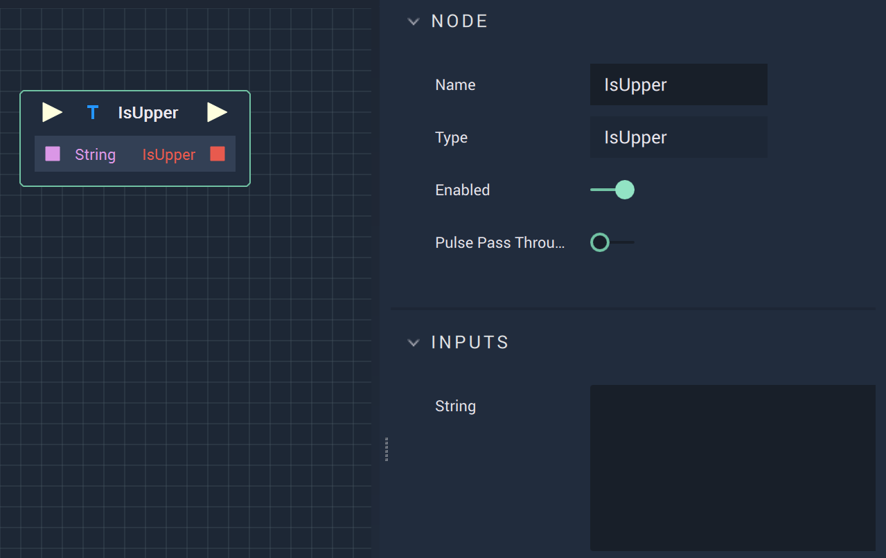

# Overview

The **Is Upper Node** checks if a **String** is all uppercase and returns a **Bool** of either *True* or *False*. 

# Attributes

|Attribute|Type|Description|
|---|---|---|
|`String`|**String**|The **String** to be checked.|

# Inputs

|Input|Type|Description|
|---|---|---|
|*Pulse Input* (►)|**Pulse**|A standard **Input Pulse**, to trigger the execution of the **Node**.|
|`String`|**String**|The **String** to be checked.|

# Outputs

|Output|Type|Description|
|---|---|---|
|*Pulse Output* (►)|**Pulse**|A standard **Output Pulse**, to move onto the next **Node** along the **Logic Branch**, once this **Node** has finished its execution.|
|`IsLower`|**Bool**|Returns *True* or *False* depending on if the **String** is uppercase or not.|

