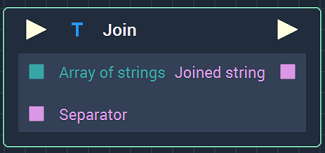
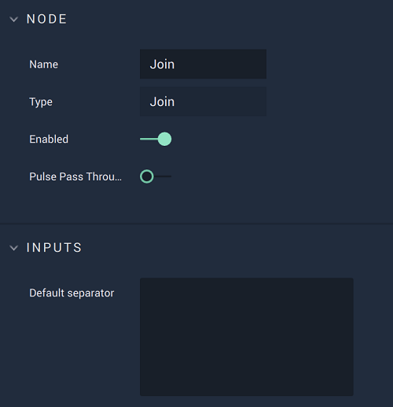

# Overview

The **Join Node** joins the elements of an **Array** populated with **Strings**. 

# Attributes

|Attribute|Type|Description|
|---|---|---|
|`Default separator`|**String**|The separator that will divide the parts of the joined **String**, such as a *space* or *comma*.

# Inputs

|Input|Type|Description|
|---|---|---|
|*Pulse Input* (►)|**Pulse**|A standard **Input Pulse**, to trigger the execution of the **Node**.|
|`Array of strings`|**Array**|The **Array** containing the **Strings** to be joined.|
|`Separator`|**String**|The separator that will divide the parts of the joined **String**, such as a *space* or *comma*.|

# Outputs

|Output|Type|Description|
|---|---|---|
|*Pulse Output* (►)|**Pulse**|A standard **Output Pulse**, to move onto the next **Node** along the **Logic Branch**, once this **Node** has finished its execution.|
|`Joined string`|**String**|The outputted joined **String**.|

