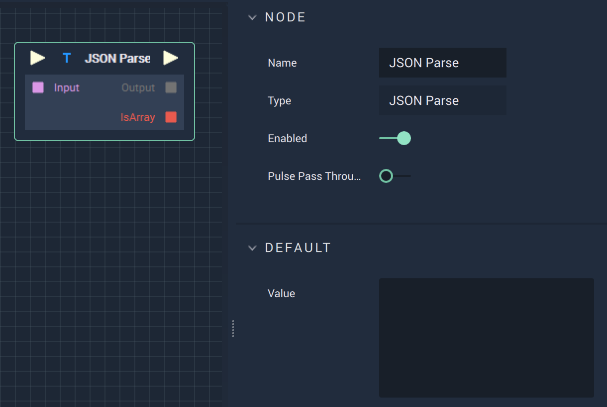

# JSON Parse

## Overview

The **JSON Parse Node** allows the user to access the values of a _JSON_ file in an **Array** format. JavaScript Object Notation \(_JSON_\) is a data-interchange format, commonly used by APIs. A **Node**, such as **HTTP Get**, can convert a _JSON_ file into a **String** format that can be used as `Input`. A **Load File Node** can also be used for the `Input` **String**. Alternatively, a _JSON_ file text can be typed into the `Value` section.

## Attributes

| Attribute | Type | Description |
| :--- | :--- | :--- |
| `Value` | **User Input** | A place to paste or type a _JSON_ file's text. |

## Inputs

| Input | Type | Description |
| :--- | :--- | :--- |
| _Pulse Input_ \(►\) | **Pulse** | A standard **Input Pulse**, to trigger the execution of the **Node**. |
| `Input` | **String** | The _JSON_ file \(in **String** format\) to parse. |

## Outputs

| Output | Type | Description |
| :--- | :--- | :--- |
| _Pulse Output_ \(►\) | **Pulse** | A standard **Output Pulse**, to move onto the next **Node** along the **Logic Branch**, once this **Node** has finished its execution. |
| `Output` | **Any** | The parsed key/value pairs of the _JSON_ file that can now be accessed as an **Array**. For a different **Data Type**, such as a **Dictionary**, the **Conversion Node** must be used first. |
| `IsArray` | **Bool** | Returns true or false whether or not the parsed output is an **Array**. |

## See Also

* [**JSON Stringify**](jsonstringify.md)
* [**Load File**](../io/loadfile.md)

