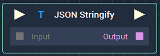
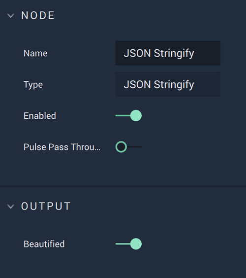

# JSON Stringify

## Overview

The **JSON Stringify Node** converts a **Data Type** like a **Dictionary** into one **String**. This can be useful when the user wants to save something like a **Dictionary** into a file.

### Attributes

| Attribute | Type | Description |
| :--- | :--- | :--- |
| `Beautified` | **Bool** | Transforms the **String** into multi-line format for easier readability. |

## Inputs

| Input | Type | Description |
| :--- | :--- | :--- |
| _Pulse Input_ \(►\) | **Pulse** | A standard **Input Pulse**, to trigger the execution of the **Node**. |
| `Input` | **Any** | The **Data Type** to convert into a **String**. |

## Outputs

| Output | Type | Description |
| :--- | :--- | :--- |
| _Pulse Output_ \(►\) | **Pulse** | A standard **Output Pulse**, to move onto the next **Node** along the **Logic Branch**, once this **Node** has finished its execution. |
| `Output` | **String** | The making **String**. |

## See Also

* [**JSON Parse**](jsonparse.md)
* [**Save File**](../io/savefile.md)

