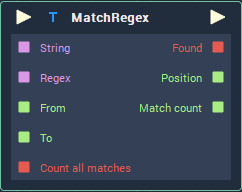

# Overview

The **MatchRegex** **Node** allows to search a **String** for certain pattern, which can be given as a *regular expression*. The part of the **String** in which the search is performed can be customized with the indices of the beginning and end of the search, which are given to the **Node** either as **Attributes** or **Inputs**. The **Node** outputs the result as a **Boolean**, together with the index of the first apparition of the searched pattern and the number of matches. 

# Attributes

## Inputs

|Attribute|Type|Description|
|---|---|---|
| `String` | **String** | The **String** in which the search will be performed, if none is given in the **Input Socket**. |
| `Pattern` | **String** | The pattern that will be searched for using regular expressions, if none is given in the `Regex` **Input Socket**. |
| `From` | **Int** | The index of `String` from which the search will begin, if none is given in the **Input Socket**. |
| `To` | **Int** | The index of `String` until which the search will be performed, if none is given in the **Input Socket**. |
| `Count all matches` | **Bool** | Whether all the matches of `Pattern` in `String` will be counted or not, if no **Bool** value is given in the **Input Socket**. |

# Inputs

|Input|Type|Description|
|---|---|---|
|*Pulse Input* (►)|**Pulse**|A standard **Input Pulse**, to trigger the execution of the **Node**.|
| `String` | **String** | The **String** in which the search will be performed.  |
| `Regex` | **String** | The pattern that will be searched for using regular expressions. |
| `From` | **Int** | The index of `String` from which the search will begin. |
| `To` | **Int** | The index of `String` until which the search will be performed.|
| `Count all matches` | **Bool** | Whether all the matches of `Regex` in `String` will be counted or not.|

# Outputs

|Output|Type|Description|
|---|---|---|
|*Pulse Output* (►)|**Pulse**|A standard **Output Pulse**, to move onto the next **Node** along the **Logic Branch**, once this **Node** has finished its execution.|
| `Found` | **Bool** | Whether `Regex` was found between the given indices of `String` or not. |
| `Position` | **Int** | The index of the first apparition of `Regex` in `String`. |
| `Match count` | **Int** | The number of matches of `Regex` in the searched part of `String`.|

# See Also

* [**ReplaceRegex**](replaceregex.md)
* [**Contains**](contains.md)

# External Links

* [*Regular expression*](https://en.wikipedia.org/wiki/Regular_expression) on Wikipedia.

