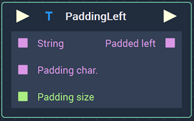
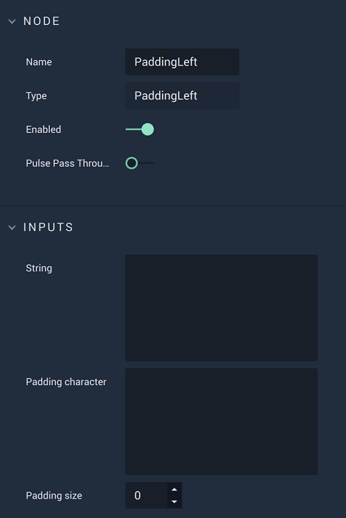

# Overview

The **PaddingLeft** **Node** adds a character a chosen number of times to the left of a **String**.

For example, padding the character "a" 6 times to the **String** "bbbbbbcccccc" gives "aaaaaabbbbbbcccccc" as the result.

The `Padding character` **Attribute** and **Input** can receive a **String** but they only use the first character.

[**Scope**](../overview.md#scopes):
*  **Project**, **Scene**, **Function**, **Prefab**

# Attributes

|Attribute|Type|Description|
|---|---|---|
| `String` | **String** | The **String** to which the `Padding character` will be added on the left, if none is given in the **Input Socket**. |
| `Padding character` | **String** | The character that will be added on the left of `String`, if none is given in the **Input Socket**. |
| `Padding size` | **Int** | The number of times that the `Padding character` will be repeated, if none is given in the **Input Socket**. |

# Inputs

|Input|Type|Description|
|---|---|---|
|*Pulse Input* (►)|**Pulse**|A standard **Input Pulse**, to trigger the execution of the **Node**.|
| `String` | **String** | The **String** to which the `Padding character` will be added on the left. |
| `Padding char.` | **String** | The character that will be added on the left of `String`. |
| `Padding size` | **Int** | The number of times that the `Padding character` will be repeated.|

# Outputs

|Output|Type|Description|
|---|---|---|
|*Pulse Output* (►)|**Pulse**|A standard **Output Pulse**, to move onto the next **Node** along the **Logic Branch**, once this **Node** has finished its execution.|
| `Padded left` | **String** | The resulting **String** with the character padded on the left. |

# See Also

* [**PaddingRight**](paddingright.md)

