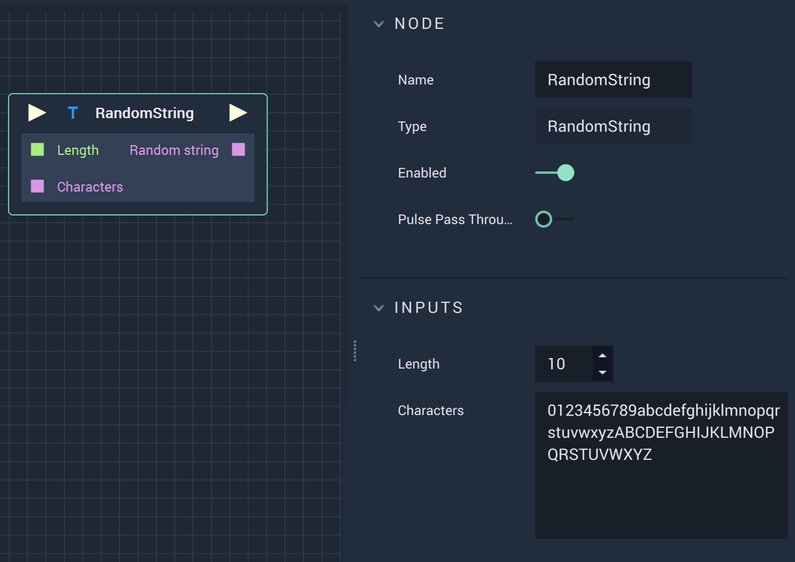

# Overview

The **RandomString Node** returns a random **String**. The length can be specified by the user.

# Attributes

|Attribute|Type|Description|
|---|---|---|
|`Length`|**Int**|The length of the random **String** to be generated.|
|`Characters`|**String**|A set of characters to be used to generate a random **String**.|

# Inputs

|Input|Type|Description|
|---|---|---|
|*Pulse Input* (►)|**Pulse**|A standard **Input Pulse**, to trigger the execution of the **Node**.|
|`Length`|**Int**|The length of the random **String** to be generated.|
|`Characters`|**String**|A set of characters to be used to generate a random **String**.|

# Outputs

|Output|Type|Description|
|---|---|---|
|*Pulse Output* (►)|**Pulse**|A standard **Output Pulse**, to move onto the next **Node** along the **Logic Branch**, once this **Node** has finished its execution.|
|`Random string`|**Random string**|Returns the random **String**.|

