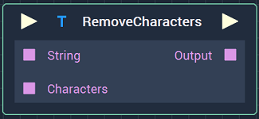
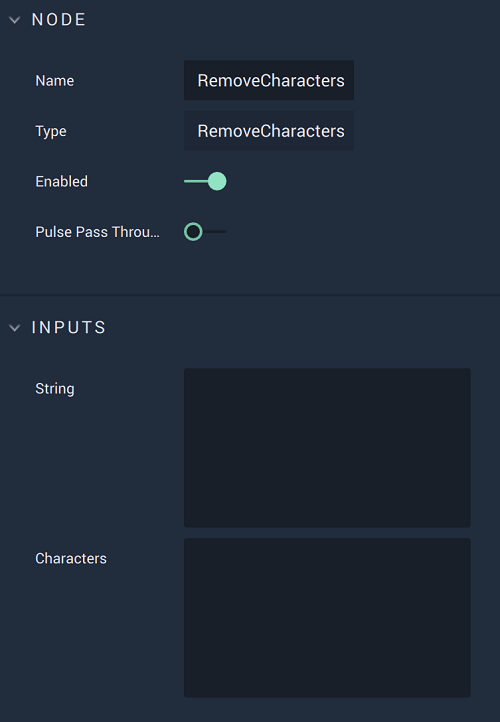

# Overview

The **RemoveCharacters** **Node** removes characters from a **String**. It takes as inputs a **String** and the characters to remove and it outputs the **String** with the characters removed.

It removes all occurrences of each of the characters specified. For instance, giving `The dogs and the foxes go towards that house` for the **String** input and `os` for the characters to be removed will result in the output: `The dg and the fxe g tward that hue`.

[**Scope**](../overview.md#scopes): **Project**, **Scene**, **Function**, **Prefab**.

# Attributes

|Attribute|Type|Description|
|---|---|---|
| `String` | **String** | The **String** from which the `Characters` will be removed, if none is given in the **Input Socket**. |
| `Characters` | **String** | The characters that will be removed from `String`, if none is given in the **Input Socket**. |

# Inputs

|Input|Type|Description|
|---|---|---|
|*Pulse Input* (►)|**Pulse**|A standard **Input Pulse**, to trigger the execution of the **Node**.|
| `String` | **String** | The **String** from which the `Characters` will be removed. |
| `Characters` | **String** | The characters that will be removed from `String`. |

# Outputs

|Output|Type|Description|
|---|---|---|
|*Pulse Output* (►)|**Pulse**|A standard **Output Pulse**, to move onto the next **Node** along the **Logic Branch**, once this **Node** has finished its execution.|
| `Output` | **String** | The `String` with the `Characters` removed. |

