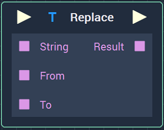
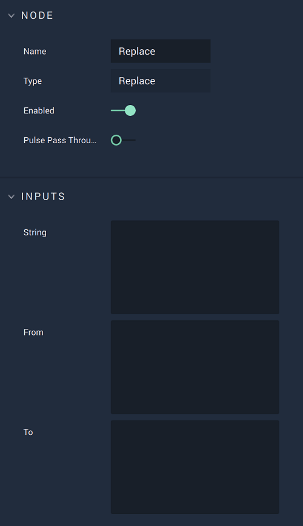

# Overview

The **Replace** **Node** replaces a *substring* of a **String** with another given **String**. It receives three inputs:

* `String`: The **String** whose *substring* will be replaced.
* `From`: The *substring* of `String` that will be replaced.
* `To`: The **String** with which `From` will be replaced.

For example, if the inputs are: `String`=`ababab`, `From`=`a`, and `To`=`C`; the output will be `Result`=`CbCbCb`.

# Attributes

## Inputs

|Attribute|Type|Description|
|---|---|---|
| `String` | **String** | **String** whose *substring* will be replaced, if none is given in the **Input Socket**. |
| `From` | **String** | *Substring* of `String` that will be replaced, if none is given in the **Input Socket**.  |
| `To` | **String** | **String** with which `From` will be replaced, if none is given in the **Input Socket**. |

# Inputs

|Input|Type|Description|
|---|---|---|
|*Pulse Input* (►)|**Pulse**|A standard **Input Pulse**, to trigger the execution of the **Node**.|
| `String` | **String** | **String** whose *substring* will be replaced. |
| `From` | **String** | *Substring* of `String` that will be replaced. |
| `To` | **String** | **String** with which `From` will be replaced. |

# Outputs

|Output|Type|Description|
|---|---|---|
|*Pulse Output* (►)|**Pulse**|A standard **Output Pulse**, to move onto the next **Node** along the **Logic Branch**, once this **Node** has finished its execution.|
| `Result` | **String** | The resulting **String** after the replacement. |

# See Also

* [**ReplaceRegex**](replaceregex.md)

