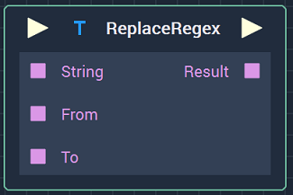
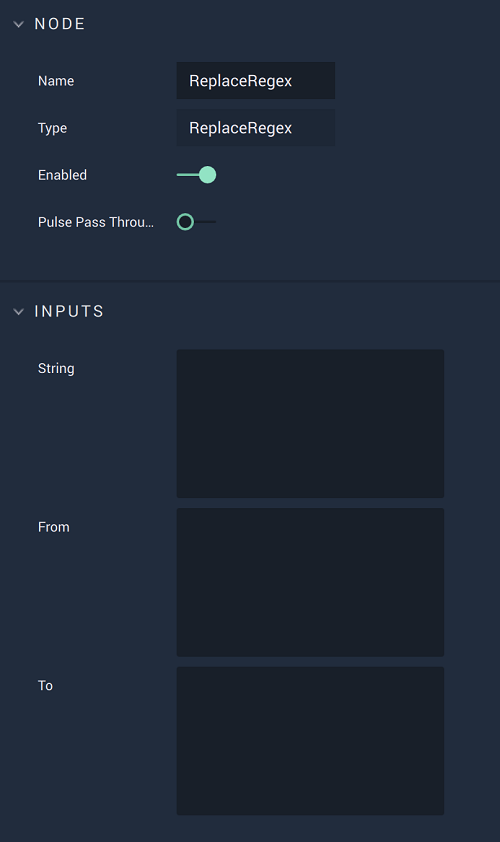

# Overview

The **ReplaceRegex** **Node** allows to replace parts of a **String** using regular expressions to search for the pattern to replace. 

# Attributes

## Inputs

|Attribute|Type|Description|
|---|---|---|
| `String` | **String** | **String** in which some parts will be replaced, if none is given in the **Input Socket**. |
| `From` | **String** | The pattern that will be searched for and replaced using regular expressions, if none is given in the **Input Socket**. |
| `To` | **String** | **String** that will replace the pattern defined in `From`, if none is given in the **Input Socket**. |

# Inputs

|Input|Type|Description|
|---|---|---|
|*Pulse Input* (►)|**Pulse**|A standard **Input Pulse**, to trigger the execution of the **Node**.|
| `String` | **String** | **String** in which some parts will be replaced. |
| `From` | **String** | The pattern that will be searched for and replaced using regular expressions. |
| `To` | **String** | **String** that will replace the pattern defined in `From`. |

# Outputs

|Output|Type|Description|
|---|---|---|
|*Pulse Output* (►)|**Pulse**|A standard **Output Pulse**, to move onto the next **Node** along the **Logic Branch**, once this **Node** has finished its execution.|
| `Result` | **String** | The resulting **String** after the pattern has been replaced. |

# See Also

* [**Replace**](replace.md)
* [**MatchRegex**](match-regex.md)

# External Links

* [*Regular expression*](https://en.wikipedia.org/wiki/Regular_expression) on Wikipedia.

