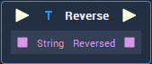

# Overview

The **Reverse** **Node** takes a **String** and reverses it.

For example, if the **Input** is "dog", the **Output** will be "god".

# Attributes

## Inputs

|Attribute|Type|Description|
|---|---|---|
| `String` | **String** | The **String** to reverse, if none is given in the **Input Socket**. |

# Inputs

|Input|Type|Description|
|---|---|---|
|*Pulse Input* (►)|**Pulse**|A standard **Input Pulse**, to trigger the execution of the **Node**.|
| `String` | **String** | The **String** to reverse. |

# Outputs

|Output|Type|Description|
|---|---|---|
|*Pulse Output* (►)|**Pulse**|A standard **Output Pulse**, to move onto the next **Node** along the **Logic Branch**, once this **Node** has finished its execution.|
| `Reversed` | **String** | The reversed **String**. |

