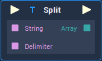

# Overview

**Split** .

# Attributes

## Inputs

|Attribute|Type|Description|
|---|---|---|
| `String` | **String** | |
| `Delimiter` | **String** | |

# Inputs

|Input|Type|Description|
|---|---|---|
|*Pulse Input* (►)|**Pulse**|A standard **Input Pulse**, to trigger the execution of the **Node**.|
| `String` | **String** | |
| `Delimiter` | **String** | |

# Outputs

|Output|Type|Description|
|---|---|---|
|*Pulse Output* (►)|**Pulse**|A standard **Output Pulse**, to move onto the next **Node** along the **Logic Branch**, once this **Node** has finished its execution.|
| `Array` | **Array** | |

# See Also

# External Links

