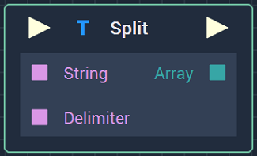
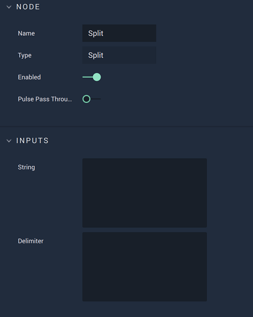

# Overview

The **Split** **Node** separates a **String** into two or more **Strings**. It receives as inputs the **String** to separate and a delimiter **String**, which marks where the separations will be made. Thus, if the **String** to split is `abcdecba` and the delimiter is `c`, the resulting **Strings** will be `ab`, `de`, and `ba`.

The resulting **Strings** are outputted in an **Array**.

In the case that the delimiter is not contained in the **String** to separate, the output is an **Array** containing just the original **String**.

[**Scope**](../overview.md#scopes):
*  **Project**, **Scene**, **Function**, **Prefab**

# Attributes

## Inputs

|Attribute|Type|Description|
|---|---|---|
| `String` | **String** | **String** to be separated, if none is given in the **Input Socket**. |
| `Delimiter` | **String** | **String** that marks where to split `String`, if none is given in the **Input Socket**. |

# Inputs

|Input|Type|Description|
|---|---|---|
|*Pulse Input* (►)|**Pulse**|A standard **Input Pulse**, to trigger the execution of the **Node**.|
| `String` | **String** | **String** to be separated. |
| `Delimiter` | **String** | **String** that marks where to split `String`. |

# Outputs

|Output|Type|Description|
|---|---|---|
|*Pulse Output* (►)|**Pulse**|A standard **Output Pulse**, to move onto the next **Node** along the **Logic Branch**, once this **Node** has finished its execution.|
| `Array` | **Array** | **Array** containing the **Strings** that resulted from the split.  |

# See Also

* [**Concat Strings**](concatstrings.md)

