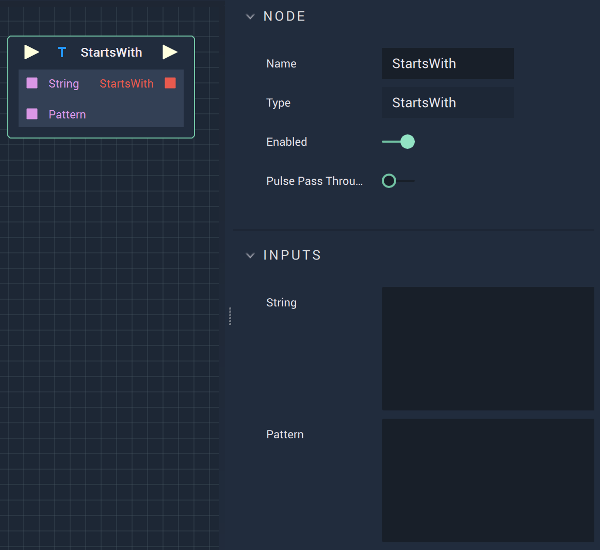

# Overview

The **StartsWith Node** checks if a **String** starts with a substring, or `Pattern`, and returns a **Bool** of either *True* or *False*.

# Attributes

|Attribute|Type|Description|
|---|---|---|
|`String`|**String**|The **String** to be checked.|
|`Pattern`|**String**|The substring that will be compared to the start of the aforementioned **String**.|

# Inputs

|Input|Type|Description|
|---|---|---|
|*Pulse Input* (►)|**Pulse**|A standard **Input Pulse**, to trigger the execution of the **Node**.|
|`String`|**String**|The **String** to be checked.|
|`Pattern`|**String**|The substring that will be compared to the start of the aforementioned **String**.|

# Outputs

|Output|Type|Description|
|---|---|---|
|*Pulse Output* (►)|**Pulse**|A standard **Output Pulse**, to move onto the next **Node** along the **Logic Branch**, once this **Node** has finished its execution.|
|`StartsWith`|**Bool**|Returns *True* or *False* depending on whether the comparison is true or not.|

# See Also

* [**EndsWith**](endswith.md)

