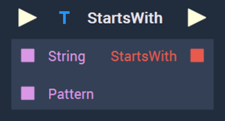
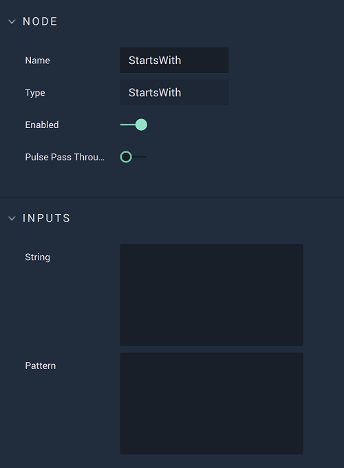

# StartsWith

## Overview

The **StartsWith Node** checks if a **String** starts with a _substring_, or `Pattern`, and returns a **Bool** of either _True_ or _False_.

[**Scope**](../overview.md#scopes): **Project**, **Scene**, **Function**, **Prefab**.

## Attributes

| Attribute | Type       | Description                                                                                                                        |
| --------- | ---------- | ---------------------------------------------------------------------------------------------------------------------------------- |
| `String`  | **String** | The **String** to be checked.                                                                                                      |
| `Pattern` | **String** | The _substring_ that will be compared to the start of the aforementioned **String**, if none is given in the **Input** **Socket**. |

## Inputs

| Input             | Type       | Description                                                                          |
| ----------------- | ---------- | ------------------------------------------------------------------------------------ |
| _Pulse Input_ (►) | **Pulse**  | A standard **Input Pulse**, to trigger the execution of the **Node**.                |
| `String`          | **String** | The **String** to be checked.                                                        |
| `Pattern`         | **String** | The _substring_ that will be compared to the start of the aforementioned **String**. |

## Outputs

| Output             | Type      | Description                                                                                                                            |
| ------------------ | --------- | -------------------------------------------------------------------------------------------------------------------------------------- |
| _Pulse Output_ (►) | **Pulse** | A standard **Output Pulse**, to move onto the next **Node** along the **Logic Branch**, once this **Node** has finished its execution. |
| `StartsWith`       | **Bool**  | Returns _True_ or _False_ depending on whether the comparison is true or not.                                                          |

## See Also

* [**EndsWith**](endswith.md)

## External Links

* More on _substrings_ on [Wikipedia](https://en.wikipedia.org/wiki/Substring).
