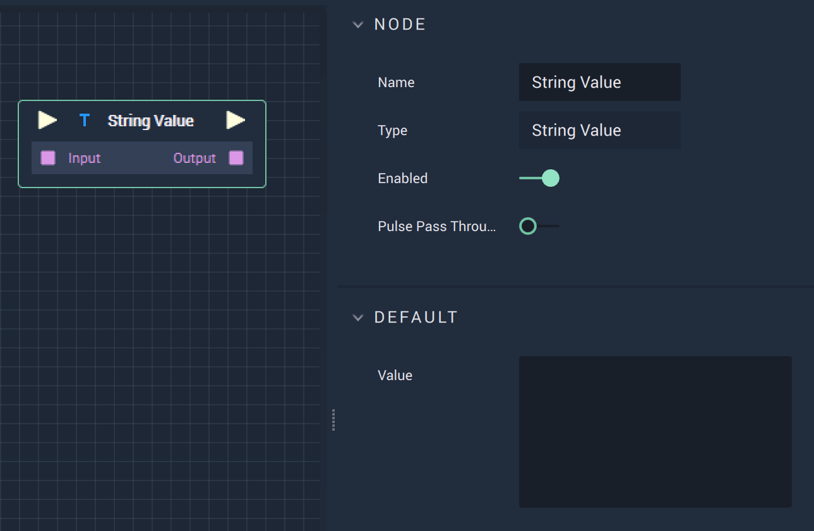

# Overview

The **String Value Node** returns that `Value`, or contents, of a **String**.

# Attributes

|Attribute|Type|Description|
|---|---|---|
|`Value`|**User Input**|User inputted text set as the `Value` when there is nothing connected to `Input` on the **Node**.| 

# Inputs

|Input|Type|Description|
|---|---|---|
|*Pulse Input* (►)|**Pulse**|A standard **Input Pulse**, to trigger the execution of the **Node**.|
|`Input`|**String**|The **String Variable** set as the `Value`.|

# Outputs

|Output|Type|Description|
|---|---|---|
|*Pulse Output* (►)|**Pulse**|A standard **Output Pulse**, to move onto the next **Node** along the **Logic Branch**, once this **Node** has finished its execution.|
|`Output`|**String**|The ouputted `Value` of the **String**.|

