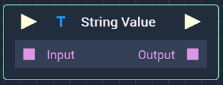
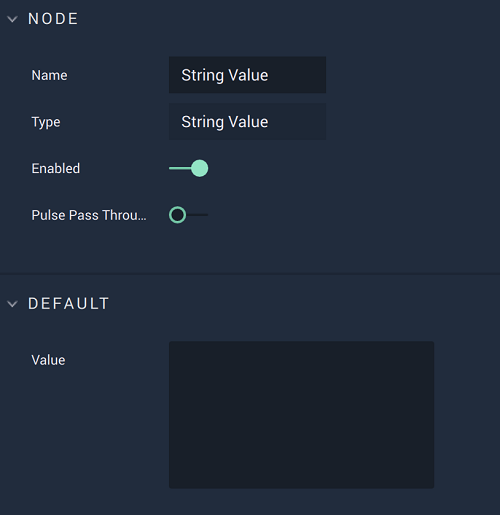

# String Value

## Overview

The **String Value Node** returns the `Value`, or contents, of a **String**.

*Scope*: **Project**, **Scene**, **Function**, **Prefab**

## Attributes

| Attribute | Type | Description |
| :--- | :--- | :--- |
| `Value` | **User Input** | User inputted text set as the `Value` when there is nothing connected to `Input` on the **Node**. |

## Inputs

| Input | Type | Description |
| :--- | :--- | :--- |
| _Pulse Input_ \(►\) | **Pulse** | A standard **Input Pulse**, to trigger the execution of the **Node**. |
| `Input` | **String** | The **String Variable** set as the `Value`. |

## Outputs

| Output | Type | Description |
| :--- | :--- | :--- |
| _Pulse Output_ \(►\) | **Pulse** | A standard **Output Pulse**, to move onto the next **Node** along the **Logic Branch**, once this **Node** has finished its execution. |
| `Output` | **String** | The ouputted `Value` of the **String**. |

