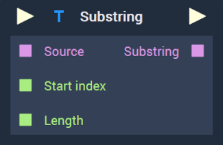
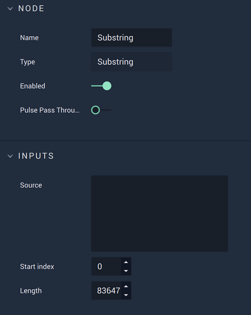

# Overview

The **Substring Node** returns a part of a **String** based on the specified parameters given by the user. 

For example, if the given **String** were `Lorem Ipsum` and the start index were `6` and the length of the substring were `5`, the output would be `Ipsum`. 

[**Scope**](../overview.md#scopes): **Project**, **Scene**, **Function**, **Prefab**.

# Attributes

|Attribute|Type|Description|
|---|---|---|
|`Source`|**String**|The original **String** that the **Substring** will come from, if one is not provided in the **Input Socket**.|
|`Start index`|**Int**|The place in the **String** where the **Substring** should start, if one is not provided in the **Input Socket**. The first index is 0.|
|`Length`|**Int**|The length of the desired *substring*, if one is not provided in the **Input Socket**. This will decide the end of the *substring* as well.|

# Inputs

|Input|Type|Description|
|---|---|---|
|*Pulse Input* (►)|**Pulse**|A standard **Input Pulse**, to trigger the execution of the **Node**.|
|`Source`|**String**|The original **String** that the *substring* will come from.|
|`Start index`|**Int**|The place in the **String** where the **Substring** should start. The first index is 0.|
|`Length`|**Int**|The length of the desired *substring*. This will decide the end of the *substring* as well.|

# Outputs

|Output|Type|Description|
|---|---|---|
|*Pulse Output* (►)|**Pulse**|A standard **Output Pulse**, to move onto the next **Node** along the **Logic Branch**, once this **Node** has finished its execution.|
|`Substring`|**String**|The resulting *substring*.|

