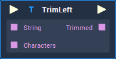

# Overview

The **TrimLeft** **Node** trims certain chosen characters from the left side of a **String**, until a different character is found. It receives as **Input** a **String** to be trimmed and the characters to trim, and it outputs the trimmed **String**.

For example, trimming the characters "ab" from the **String** "babbaacababa" gives as result the trimmed **String** "cababa".

# Attributes

|Attribute|Type|Description|
|---|---|---|
| `String`| **String** | |
| `Characters` | **String** | |

# Inputs

|Input|Type|Description|
|---|---|---|
|*Pulse Input* (►)|**Pulse**|A standard **Input Pulse**, to trigger the execution of the **Node**.|
| `String` | **String** | |
| `Characters` | **String** | |

# Outputs

|Output|Type|Description|
|---|---|---|
|*Pulse Output* (►)|**Pulse**|A standard **Output Pulse**, to move onto the next **Node** along the **Logic Branch**, once this **Node** has finished its execution.|
| `Trimmed` | **String** | |

# See Also

* [**TrimRight**](trimright.md)
* [**Trim**](trim.md)

# External Links

