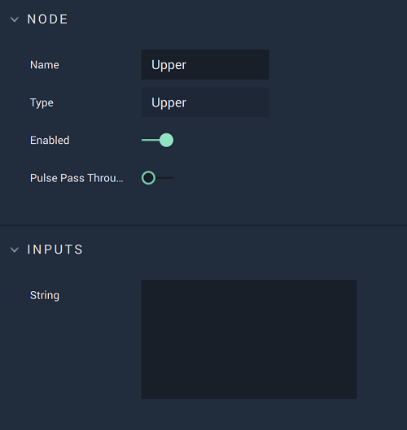

# Overview

The **Upper** **Node** converts a **String** to uppercase letters.

[**Scope**](../overview.md#scopes):
*  **Project**, **Scene**, **Function**, **Prefab**

# Attributes

## Inputs

|Attribute|Type|Description|
|---|---|---|
| `String` | **String** | The **String** to be converted to uppercase, if none is received in the **Input Socket**.|

# Inputs

|Input|Type|Description|
|---|---|---|
|*Pulse Input* (►)|**Pulse**|A standard **Input Pulse**, to trigger the execution of the **Node**.|
| `String` | **String** | The **String** to be converted to uppercase. |

# Outputs

|Output|Type|Description|
|---|---|---|
|*Pulse Output* (►)|**Pulse**|A standard **Output Pulse**, to move onto the next **Node** along the **Logic Branch**, once this **Node** has finished its execution.|
| `Result` | **String** | The **String** converted to uppercase. |

# See Also

* [**Lower**](lower.md)