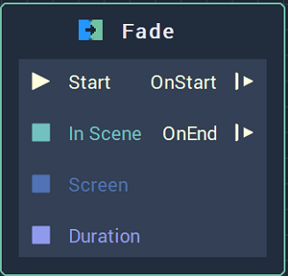
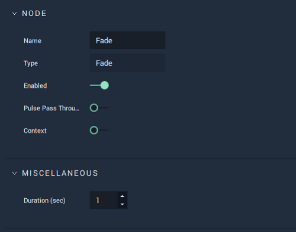

# Overview

The **Fade** **Node** creates a **Transition** between **Scenes** in which the initial **Scene** fades out and then the final **Scene** fades in. It receives as inputs the final **Scene**, the **Screen** in which the **Transition** will take place, and the duration of the **Transition**.

[**Scope**](../overview.md#scopes):
*  **Project**

# Attributes

|Attribute|Type|Description|
|---|---|---|
| `Duration (sec)` | **Float** | The duration, in seconds, of the **Transition**, if none is given in the **Input Socket**. |

# Inputs

|Input|Type|Description|
|---|---|---|
|(►) `Start` | **Pulse** | A standard **Input Pulse**, to trigger the execution of the **Node**. |
| `In Scene` | **SceneID** | The **Scene** to which the current **Scene** will **Transition** to. |
| `Screen` | **ScreenID** | The **Screen** that contains the initial and final **Scenes**. |
| `Duration` | **Float** | The duration, in seconds, of the **Transition**. |

# Outputs

|Output|Type|Description|
|---|---|---|
| `OnStart` (►) | **Pulse** | Flows to the next **Node** following **Fade** when the **Transition** starts. |
| `OnEnd` (►) | **Pulse** | Flows to the next **Node** following **Fade** when the **Transition** ends.  |

# See Also

* [**CrossFade**](crossfade.md)

