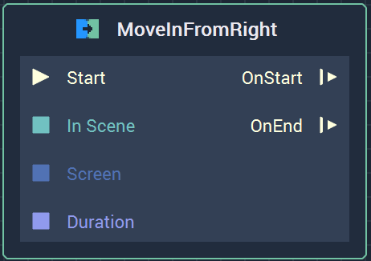
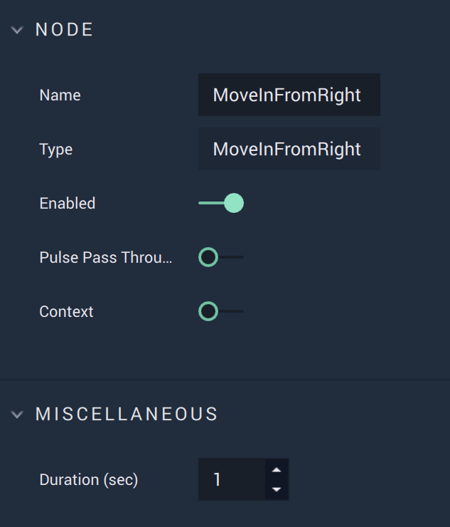

# Overview

The **MoveInFromRight Node** applies a **Transition** to the chosen **Scene**. Starting off-screen, the chosen **Scene** moves in from the right of the **Screen**. This **Transition** leads to the chosen **Scene** covering the previous **Scene**, which remains static.

[**Scope**](../overview.md#scopes):
*  **Project**

# Attributes

|Attribute|Type|Description|
|---|---|---|
|`Duration (sec)`|**Float**|The duration, in seconds, of the **Transition**, if none is given in the **Input Socket**. |

# Inputs

|Input|Type|Description|
|---|---|---|
|*Pulse Input* (►)|**Pulse**|A standard **Input Pulse**, to trigger the execution of the **Node**.|
|`Start` (►)|**Pulse**|A standard **Input Pulse**, to trigger the execution of the **Node**.|
| `In Scene` | **SceneID** | The **Scene** to which the current **Scene** will **Transition** to. |
| `Screen` | **ScreenID** | The **Screen** that contains the initial and final **Scenes**. |
| `Duration` | **Float** | The duration, in seconds, of the **Transition**. |

# Outputs

|Output|Type|Description|
|---|---|---|
|`OnStart` (►)|**Pulse**|Flows to the next **Node** following **MoveInFromRight** when the **Transition** starts. |
|`OnEnd` (►)|**Pulse**|Flows to the next **Node** following **MoveInFromRight** when the **Transition** ends. |

# See Also

* [**MoveInFromLeft**](moveinfromleft.md)
* [**MoveInFromTop**](moveinfromtop.md)
* [**MoveInFromBottom**](moveinfrombottom.md)