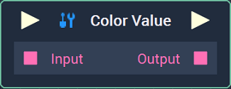
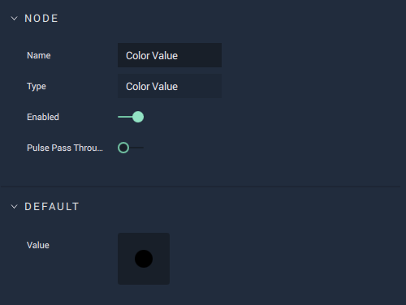

# Color Value

## Overview

The **Color Value Node** returns the `Value` of a **Color Variable** or the **Default** `Value` set in the **Attributes**.

## Attributes

| Attribute | Type | Description |
| :--- | :--- | :--- |
| `Value` | **Color Picker** | The color value, in the form of either an 8-digit **ARGB** _hex code_, **HSB** levels, or **RGBA** levels. |

## Inputs

| Input | Type | Description |
| :--- | :--- | :--- |
| _Pulse Input_ \(►\) | **Pulse** | A standard **Input Pulse**, to trigger the execution of the **Node**. |
| `Input` | **Color** | A **Color Variable** value set with either a 8-digit **ARGB** _hex code_, **HSB** levels, or **RGBA** levels. |

## Outputs

| Output | Type | Description |
| :--- | :--- | :--- |
| _Pulse Output_ \(►\) | **Pulse** | A standard **Output Pulse**, to move onto the next **Node** along the **Logic Branch**, once this **Node** has finished its execution. |
| `Output` | **Color** | A **Color Variable** value set with an 8-digit **ARGB** _hex code_, **HSB** levels, or **RGBA** levels. |

## See Also

* [**Color Attribute**](https://docs.incari.com/incari-studio/v/2021.4/getting-started/attributes/attribute-types/color-attribute)

## External Links

* Information on types of [_Hex Codes_](https://www.color-hex.com/).
* Information on the [_HSB color model_](http://teemutalja.com/blog/hsb-color-model-visual-guide/).
* The [_RGBA color model_](https://en.wikipedia.org/wiki/RGBA_color_model) on Wikipedia. 

