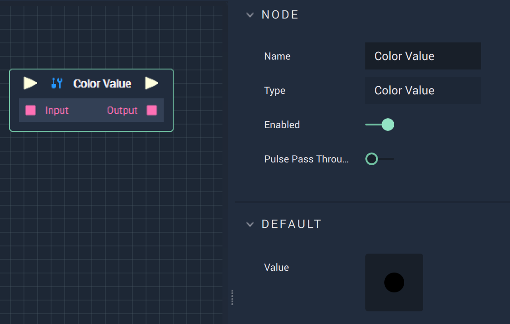

# Overview

The **Color Value Node** returns the `Value` of a **Color Variable** or the **Default** `Value` set in the **Attributes**.

# Attributes

|Attribute|Type|Description|
|---|---|---|
|`Value`|The color value, in the form of an 8-digit **ARGB** *hex code*, **HSB** levels, or **RGBA** levels.

# Inputs

|Input|Type|Description|
|---|---|---|
|*Pulse Input* (►)|**Pulse**|A standard **Input Pulse**, to trigger the execution of the **Node**.|
|`Input`|**Color**|A **Color Variable** value set with either a 8-digit **ARGB** *hex code*, **HSB** levels, or **RGBA** levels.|

# Outputs

|Output|Type|Description|
|---|---|---|
|*Pulse Output* (►)|**Pulse**|A standard **Output Pulse**, to move onto the next **Node** along the **Logic Branch**, once this **Node** has finished its execution.|
|`Output`|**Color**|A **Color Variable** value set with an 8-digit **ARGB** *hex code*, **HSB** levels, or **RGBA** levels.|

# External Links

* Information on types of [*Hex Codes*](https://www.color-hex.com/).
* Information on the [*HSB color model*](http://teemutalja.com/blog/hsb-color-model-visual-guide/).
* The [*RGBA color model*](https://en.wikipedia.org/wiki/RGBA_color_model) on Wikipedia. 