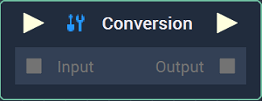
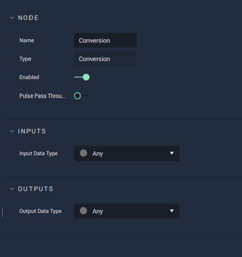

# Conversion

## Overview

The **Conversion Node** allows the user to convert one **Data Type** into another. With certain **Nodes** the **Conversion Node** appears automatically when two **Nodes** are connected.

## Attributes

| Attribute | Type | Description |
| :--- | :--- | :--- |
| `Input Data Type` | **Drop-down** | The `Data Type` of the input. |
| `Output Data Type` | **Drop-down** | The `Data Type` to be converted to. |

## Inputs

| Input | Type | Description |
| :--- | :--- | :--- |
| _Pulse Input_ \(►\) | **Pulse** | A standard **Input Pulse**, to trigger the execution of the **Node**. |
| `Input` | **Any** | The input to be converted. |

## Outputs

| Output | Type | Description |
| :--- | :--- | :--- |
| _Pulse Output_ \(►\) | **Pulse** | A standard **Output Pulse**, to move onto the next **Node** along the **Logic Branch**, once this **Node** has finished its execution. |
| `Output` | **Any** | The output data, now as the converted `Data Type`. |

## See Also

* [**Data Types**](../../getting-started/data-types/README.md)
* [**Attribute Types**](../../getting-started/attributes/attribute-types/README.md)
* [**Common Attributes**](../../getting-started/attributes/common-attributes/README.md)

