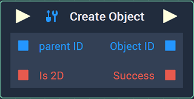
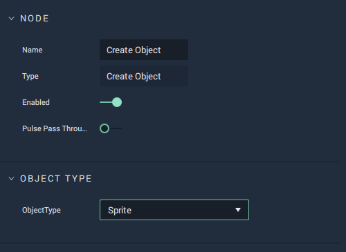

# Overview

The **Create Object** **Node** creates [**Scene Objects**](../../objects-and-types/scene-objects/README.md) of a chosen **Object Type**.

In the **Attributes**, the **Object Type** for the new **Object** can be chosen. The outputs are the **ObjectID** of the newly created **Object** and a **Bool** value indicating whether the creation of the **Object** was successful or not.

[**Scope**](../overview.md#scopes): **Project**, **Scene**, **Function**.

# Attributes

## Object Type

|Attribute|Type|Description|
|---|---|---|
| `Object Type` | **Drop-down** | The **Object Type** of the newly created **Object**. |

# Inputs

|Input|Type|Description|
|---|---|---|
|*Pulse Input* (►)|**Pulse**|A standard **Input Pulse**, to trigger the execution of the **Node**.|
| `Parent ID` | **ObjectID** | **ObjectID** of a **Group** that the newly created **Object** will be part of. |
| `is 2D` | **Bool** | Whether the newly created **Object** will be *2D* or *3D*. |

# Outputs

|Output|Type|Description|
|---|---|---|
|*Pulse Output* (►)|**Pulse**|A standard **Output Pulse**, to move onto the next **Node** along the **Logic Branch**, once this **Node** has finished its execution.|
| `Object ID` | **ObjectID** | The unique generated **ObjectID** of the newly created **Object**. |
| `Success` | **Bool** | Whether the operation of creating the desired **Object** was successful or not. |

# See Also

* [**Scene Objects**](../../objects-and-types/scene-objects/README.md)

