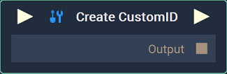

# Create CustomID

## Overview

Every item in **Incari** has a unique ID number, including **Assets**, **Nodes**, **Variables**, **Materials**, **Objects**, **Scenes**, and **Screens**. The **Create** **CustomID** **Node** creates a new unique ID. (Note: these are the **Instance IDs** of **Animations** and **Actions**.)

This way, for example, the user can create a new ID for an **Animation Block** to differentiate between several **Play Animation Nodes**. This allows one to play different **Animations** simultaneously and have them appear as unique to each other within **Incari**.  

Furthermore, it is possible for the same **Animation** to have multiple *instances*, thus resulting in different ID numbers for one **Animation**. Similarly, unless specified with the **Create CustomID Node**, two separate **Animations** will actually have the same ID (42) when passed through different **Play** **Animation** **Nodes**. To eliminate this possibility, one simply needs to create a **CustomID** before adding an **Animation** as input.

All of this also applies to **Actions**. For **Actions**, the default ID is 0. Refer to the links below to read more on **Animations** and **Actions** in **Incari**.

## Inputs

| Input | Type | Description |
| :--- | :--- | :--- |
| _Pulse Input_ \(►\) | **Pulse** | A standard **Input Pulse**, to trigger the execution of the **Node**. |

## Outputs

| Output | Type | Description |
| :--- | :--- | :--- |
| _Pulse Output_ \(►\) | **Pulse** | A standard **Output Pulse**, to move onto the next **Node** along the **Logic Branch**, once this **Node** has finished its execution. |
| `Output` | **CustomID** | A new, unique ID number. |

# See Also

* [**Animation**](toolbox\incari\animation\README.md)
* [**4 Methods of Animation**](demo-projects\4-methods-of-animation.md)
* [**Actions**](toolbox\actions\README.md)