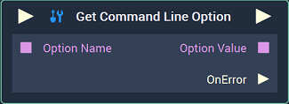
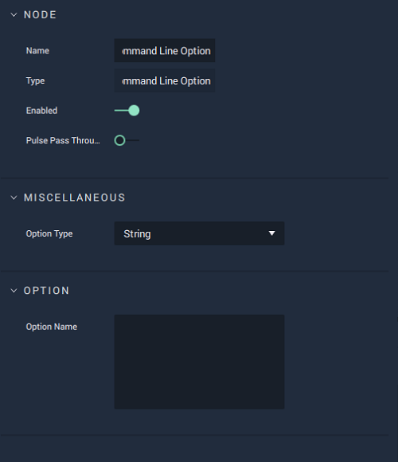

# Overview

The **Get Command Line Option** **Node** allows the user to obtain the command-line arguments, named options, that were given when the **Project** was initiated and then use them in the **Logic**.

[**Scope**](../overview.md#scopes): **Project**, **Scene**, **Function**.

# Attributes

## Miscellaneous

|Attribute|Type|Description|
|---|---|---|
| `Option Type` | **Drop-Down** | The **Data Type** of the command-line arguments. |

## Option

|Attribute|Type|Description|
|---|---|---|
| `Option Name` | **String** | Name given to the retrieved option, if none is received in the **Input Socket**.|

# Inputs

|Input|Type|Description|
|---|---|---|
|*Pulse Input* (►)|**Pulse**|A standard **Input Pulse**, to trigger the execution of the **Node**.|
| `Option Name` | **String** | Name given to the retrieved option. |

# Outputs

|Output|Type|Description|
|---|---|---|
|*Pulse Output* (►)|**Pulse**|A standard **Output Pulse**, to move onto the next **Node** along the **Logic Branch**, once this **Node** has finished its execution.|
| `Option Value` | _Defined in the `Option Type` **Attribute**_ | The value of the option given in the command-line. |
| `OnError` (►) | **Pulse** | A **Pulse** that will be triggered if there is an error in retrieving the arguments from the command-line. |

