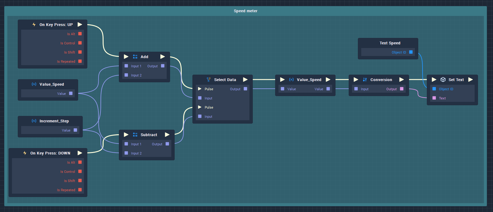
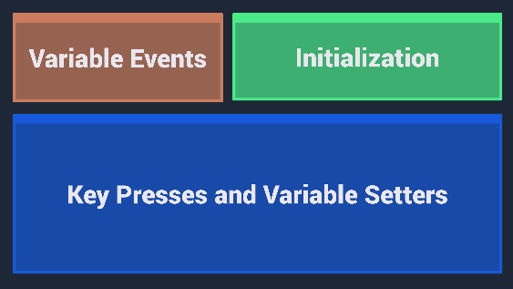

# Group

## Overview

A **Group Node** is used as a container for other **Logic**. As the color, opacity, size, and name can all be changed, it is very useful for management and organization.

The easiest way to create a **Group** is to select some **Nodes** and then press `Ctrl` + `G`, but it is also available in the right-click context menu.

Another advantage of the **Group Node** is that by changing the `Name` **Attribute** you can easily create descriptive comments for your blocks of **Logic**. When you zoom out beyond a certain threshold within the **Logic Editor**, text on **Nodes** is no longer rendered, however, the _names_ of the **Group Nodes** are.

[**Scope**](../overview.md#scopes): **Project**, **Scene**, **Function**.

## Attributes

### Color

| Attribute       | Type      | Description                                                                                                                                                                                                              |
| --------------- | --------- | ------------------------------------------------------------------------------------------------------------------------------------------------------------------------------------------------------------------------ |
| `Color`         | **Color** | The **Color** of the **Group Node**.                                                                                                                                                                                     |
| `ZIndex`        | **Int**   | The `ZIndex` determines the stack order of the **Group** **Node**. Therefore a **Group** **Node** with a higher `ZIndex` will be stacked in front of a **Group** **Node** with a lower `ZIndex` in the **Logic Editor**. |
| `Content Alpha` | **Int**   | The _alpha_ value of the **Group** **Node**'s color space.                                                                                                                                                               |

## Usage

 (4) (4) (4) (1) (1) (6).gif>)
