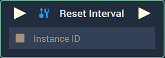

# Reset Interval

## Overview

The **Reset Interval Node** resets an existing **Interval** by taking the **Instance** of an **Interval** as input. This causes an **Interval** to cease until further notice. If multiple **Intervals** have been started by the **Start Interval** **Node**, they must be stopped one by one. 

For example, if an **Interval** was started twice -- where *A* is printed to the **Console** every 5 seconds -- *A* will keep printing until the **Reset Interval** is triggered twice as well. Simply put, triggering it only once will not stop the second **Interval**.  

[**Scope**](../overview.md#scopes):
*  **Project**, **Scene**, **Function**

## Inputs

| Input | Type | Description |
| :--- | :--- | :--- |
| _Pulse Input_ \(►\) | **Pulse** | A standard **Input Pulse**, to trigger the execution of the **Node**. |
| `Instance ID` | **InstanceID** | The assigned **Instance** of an **Interval**. |

## Outputs

| Output | Type | Description |
| :--- | :--- | :--- |
| _Pulse Output_ \(►\) | **Pulse** | A standard **Output Pulse**, to move onto the next **Node** along the **Logic Branch**, once this **Node** has finished its execution. |

## See Also

* [**Start Interval**](startinterval.md)

