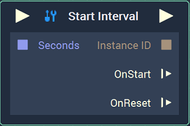
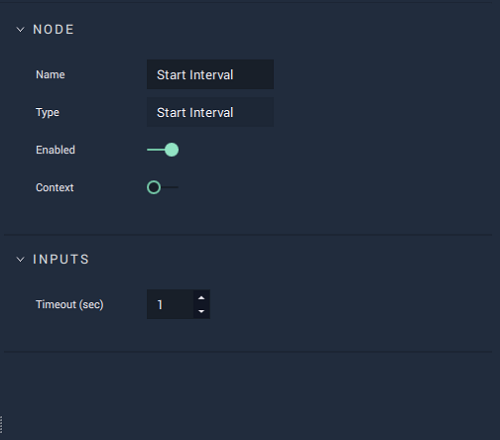

# Start Interval

## Overview

The **Start Interval Node** sets an **Interval**, which occurs every _X_ `Seconds` (or `Timeout (sec)`). When the **Start Interval Node** fires, the **Logic** connected to the **Output Pulse Socket** will be repeated every *X* seconds. At the same time, **OnStart** is triggered immediately. An **Instance ID** will be created, thus serving as an input for the **Reset Interval Node**. If **Reset Interval** -- connected by the **Instance ID** -- is triggered, **OnReset** fires. 

Important to note is that an **Interval** will continue firing until a **Reset Interval Node** is triggered. Without resetting it, it will run forever.

[**Scope**](../overview.md#scopes):
*  **Project**, **Scene**, **Function**

## Attributes

| Attribute | Type | Description |
| :--- | :--- | :--- |
| `Timeout (sec)` | **Float** | The time it takes to reach the next occurrence of the **Interval**. |

## Inputs

| Input | Type | Description |
| :--- | :--- | :--- |
| _Pulse Input_ \(►\) | **Pulse** | A standard **Input Pulse**, to trigger the execution of the **Node**. |
| `Seconds` | **Float** | The time it takes to reach the next occurrence of the **Interval**. |

## Outputs

| Output | Type | Description |
| :--- | :--- | :--- |
| _Pulse Output_ \(►\) | **Pulse** | A standard **Output Pulse**, to move onto the next **Node** along the **Logic Branch**, once this **Node** has finished its execution. |
| `Instance ID` | **InstanceID** | The assigned **Instance** of the **Interval**. |
| `OnStart` \(►\) | **Pulse** | Flows to additional actions following **Start Interval** when it starts. |
| `OnReset` \(►\) | **Pulse** | Flows to additional actions following **Reset Interval** when it is reset. |

## See Also

* [**Reset Interval**](resetinterval.md)

