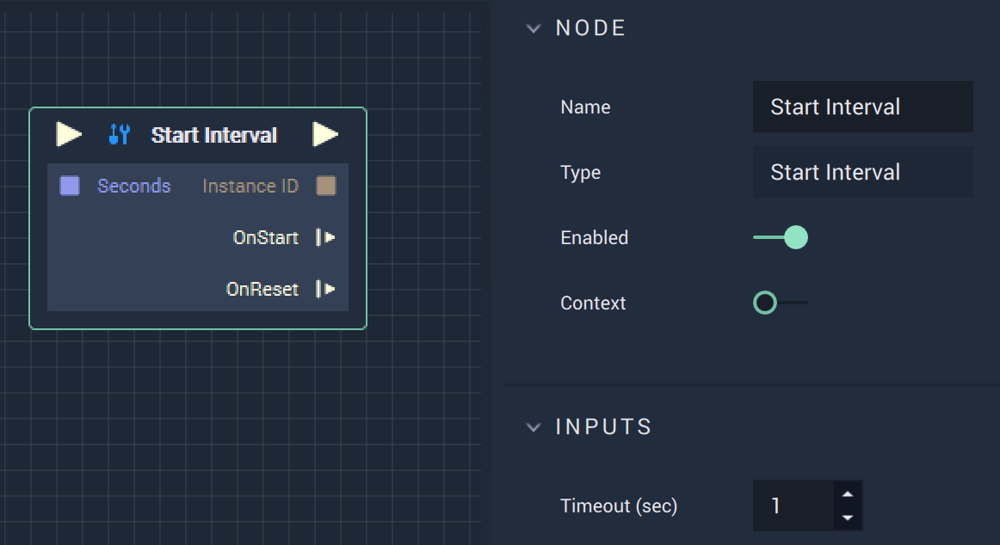

# Overview

The **Start Interval Node** sets an **Interval**, which occurs every *X* seconds, as specified in `Seconds` or `Timeout (sec)`.

# Attributes

|Attribute|Type|Description|
|---|---|---|
|`Timeout (sec)`|**Float**|The time it takes to reach the next occurrence of the **Interval**.| 

# Inputs

|Input|Type|Description|
|---|---|---|
|*Pulse Input* (►)|**Pulse**|A standard **Input Pulse**, to trigger the execution of the **Node**.|
|`Seconds`|**Float**|The time it takes to reach the next occurrence of the **Interval**.|
# Outputs

|Output|Type|Description|
|---|---|---|
|*Pulse Output* (►)|**Pulse**|A standard **Output Pulse**, to move onto the next **Node** along the **Logic Branch**, once this **Node** has finished its execution.|
|`Instance ID`|**InstanceID**|The assigned **Instance** of an **Object**.|
|`OnStart` (►)|**Pulse**|Flows to additional actions following **Start Interval** when it starts.|
|`OnReset` (►)|**Pulse**|Flows to additional actions following **Start Interval** when it is reset.|

# See Also

* [**Reset Interval**](resetinterval.md)
