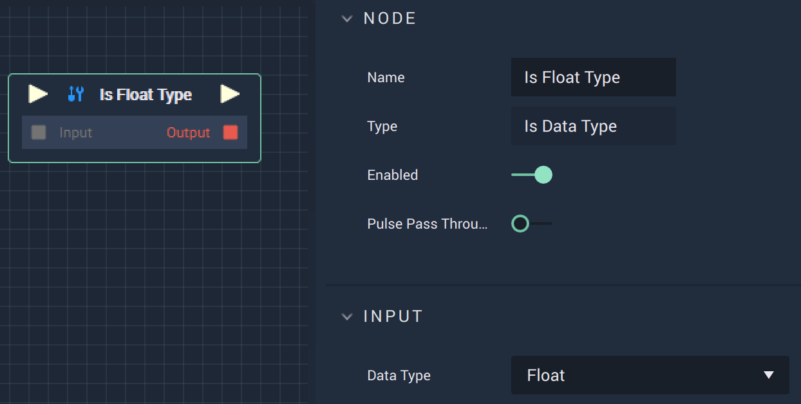

# Overview

The **Is Data Type Node** returns true or false depending on whether or not the input matches the `Data Type`.

# Attributes

|Attribute|Type|Description|
|---|---|---|
|`Data Type`|**Dropdown**|The data type to compare the input type with. The **Node** name matches the `Data Type`, in the example image this is **Float**. Alternatively, the `Data Type` can either be **Array**, **Binary**, **Bool**, **Byte**, **Color**, **Dictionary**, **Int**, **String**, or any **Vector** variable.|

# Inputs

|Input|Type|Description|
|---|---|---|
|*Pulse Input* (►)|**Pulse**|A standard **Input Pulse**, to trigger the execution of the **Node**.|
|`Input`|**Variable**|The input **Variable** to be compared with.|
# Outputs

|Output|Type|Description|
|---|---|---|
|*Pulse Output* (►)|**Pulse**|A standard **Output Pulse**, to move onto the next **Node** along the **Logic Branch**, once this **Node** has finished its execution.|
|`Output`|**Bool**|Returns true or false depending on whether or not the input matches the `Data Type`.|

# See Also 

* [**Data Types**](https://docs.incari.com/incari-studio/getting-started/data-types)

