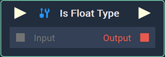
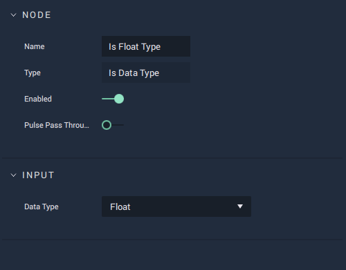
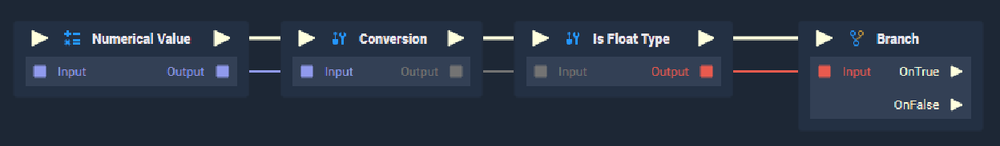

# Is Data Type

## Overview

The **Is Data Type Node** returns *true* or *false* depending on whether or not the input matches the `Data Type`.

*Scope*: **Project**, **Scene**, **Function**

## Attributes

| Attribute | Type | Description |
| :--- | :--- | :--- |
| `Data Type` | **Dropdown** | The **Data Type** to compare the input type with. The **Node** name matches the `Data Type`, in the example image this is **Float**. Alternatively, the `Data Type` can either be **Array**, **Binary**, **Bool**, **Byte**, **Color**, **Dictionary**, **Int**, **String**, or any **Vector** variable. |

## Inputs

| Input | Type | Description |
| :--- | :--- | :--- |
| _Pulse Input_ \(►\) | **Pulse** | A standard **Input Pulse**, to trigger the execution of the **Node**. |
| `Input` | **Any** | The input `Data Type` to be compared with. **Any** is a generic `Data Type` that every type can be cast to. |

## Outputs

| Output | Type | Description |
| :--- | :--- | :--- |
| _Pulse Output_ \(►\) | **Pulse** | A standard **Output Pulse**, to move onto the next **Node** along the **Logic Branch**, once this **Node** has finished its execution. |
| `Output` | **Bool** | Returns *true* or *false* depending on whether or not the input matches the `Data Type`. |

## Example Usage

The **Is Data Type Node** is useful for checking for correct `Data Types` from other sources, such as a parsed JSON file. In the above image, a **Float** is converted into the generic **Any** `Data Type`, to prove that it is indeed a **Float**. The resulting output will confirm that the `Data Type` matches the expected `Data Type` and flow to `OnTrue` for additional actions.

