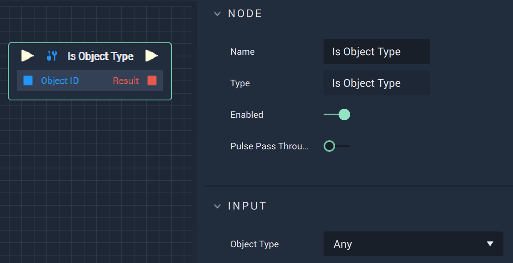

# Overview

The **Is Object Type Node** returns true or false depending on whether or not the input **Object** matches the `Object Type`.

# Attributes

|Attribute|Type|Description|
|---|---|---|
|`Object Type`|**Dropdown**|The `Object Type` to compare the input **Object** to. This covers most **Scene Object** types such as **Sprite**, **Group**, and **Mesh**.|

# Inputs

|Input|Type|Description|
|---|---|---|
|*Pulse Input* (►)|**Pulse**|A standard **Input Pulse**, to trigger the execution of the **Node**.|
|`Object ID`|**ObjectID**|The ID of the target **Object**.|

# Outputs

|Output|Type|Description|
|---|---|---|
|*Pulse Output* (►)|**Pulse**|A standard **Output Pulse**, to move onto the next **Node** along the **Logic Branch**, once this **Node** has finished its execution.|
|`Result`|**Bool**|Returns true or false depending on whether or not the input **Object** type matches the `Object Type`.|

