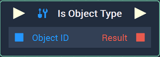
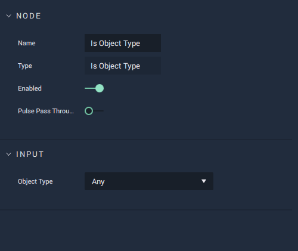

# Is Object Type

## Overview

The **Is Object Type Node** returns *true* or *false* depending on whether or not the input **Object** matches the `Object Type`.

*Scope*: **Project**, **Scene**, **Function**

## Attributes

| Attribute | Type | Description |
| :--- | :--- | :--- |
| `Object Type` | **Drop-down** | The `Object Type` to compare the input **Object** to. The `Object Type` can either be **Group**, **Image Sequence Sprite**, **Label**, **List**, **Mesh**, **On-Screen Keyboard**, **Point Light**, **Spot Light**, **Sprite**, **Text**, or **Web Sprite**. |

## Inputs

| Input | Type | Description |
| :--- | :--- | :--- |
| _Pulse Input_ \(►\) | **Pulse** | A standard **Input Pulse**, to trigger the execution of the **Node**. |
| `Object ID` | **ObjectID** | The ID of the target **Object**. |

## Outputs

| Output | Type | Description |
| :--- | :--- | :--- |
| _Pulse Output_ \(►\) | **Pulse** | A standard **Output Pulse**, to move onto the next **Node** along the **Logic Branch**, once this **Node** has finished its execution. |
| `Result` | **Bool** | Returns *true* or *false* depending on whether or not the input **Object** type matches the `Object Type`. |

